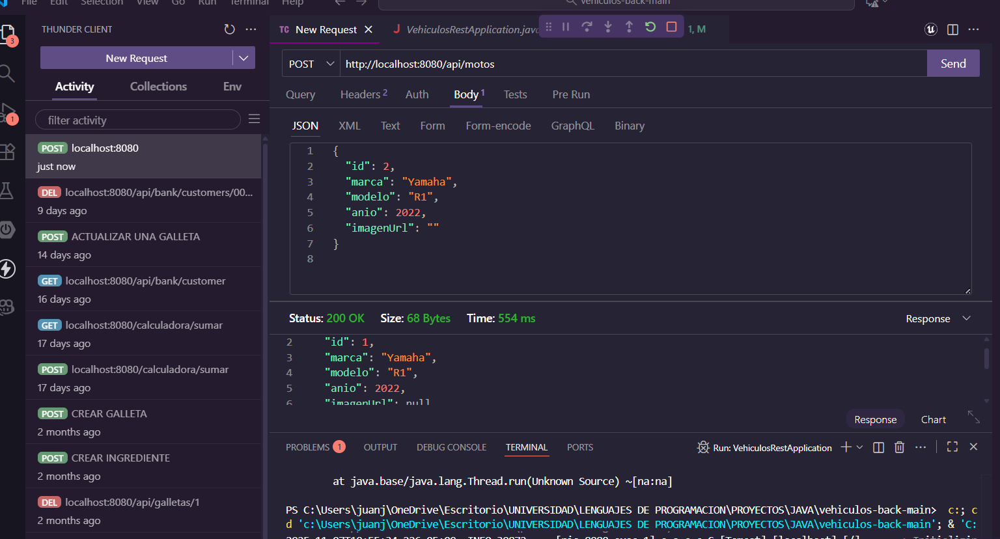
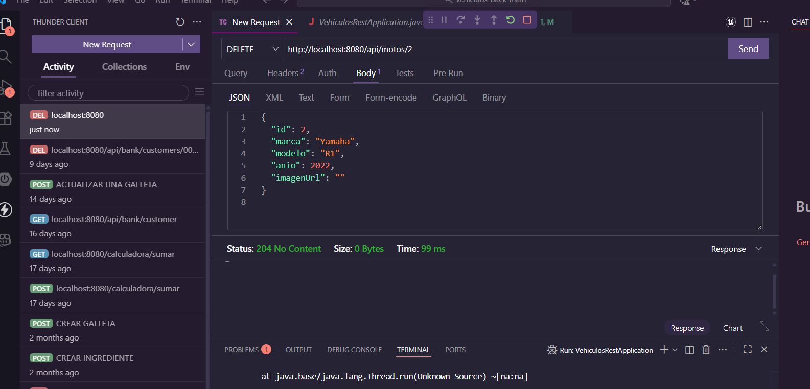
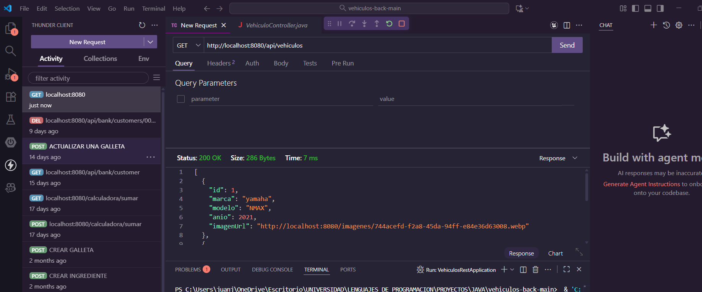
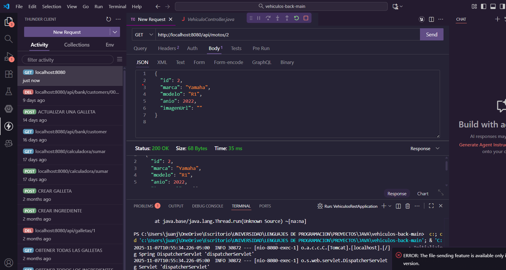

# 🚀 API de Motos y Vehiculos -- BACK END

Este proyecto permite gestionar motos y vehiculos con operaciones CRUD  
A continuación se muestran ejemplos visuales de cada endpoint:

---

## ➕ Crear Moto

---

## 🗑️ Eliminar Moto

---

## 📋 Obtener todas las Motos

---

## 🔍 Obtener Moto por ID

